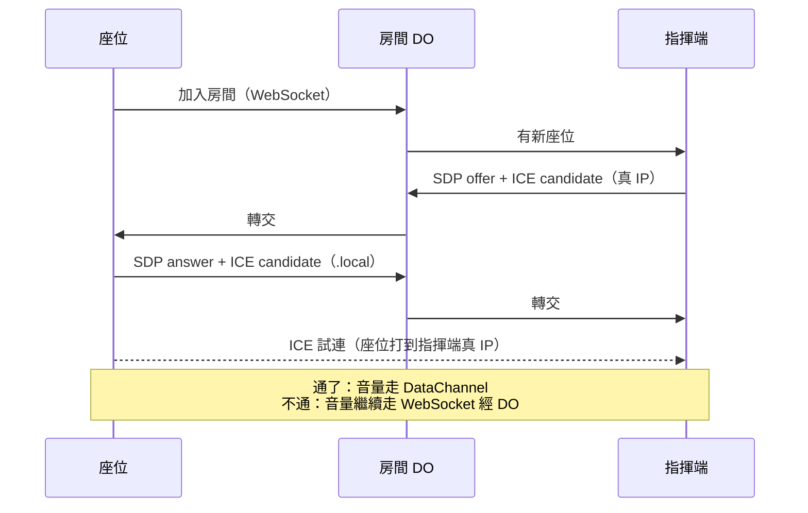

# 研究：哪些訊息改走 WebRTC 直連比較好

> 對應 issue [#12](https://github.com/yurenju/turca/issues/12)。查證日期 2026-09-26。

## 前提

原本的構想（`docs/research/initial-design.md` 第 4 節）是所有訊息都經過伺服器：每個座位和指揮端各自用 WebSocket 連到房間的 Cloudflare Durable Object（下稱 DO），由它轉送校時、速度變化、音量數值。當時因為「NAT 穿透麻煩」沒有用 WebRTC。現在地圖定了「大家連同一個 Wi-Fi 效果最好」，所以這份文件要回答：哪些訊息改成裝置之間直接連線（WebRTC DataChannel）比較好、代價是什麼、DO 還剩什麼工作。

## 名詞

- **DataChannel**：WebRTC 裡傳任意資料（不是影音）的通道。底層是 UDP 上面疊加密（DTLS）再疊 SCTP，可以選「一定送到／送不到就算了」與「照順序／不照順序」。
- **ICE candidate**：一台裝置可以被連到的一個位址。分三種：**host**（本機網卡的位址，同一個 Wi-Fi 下就是區網 IP）、**srflx**（透過 STUN 問出來的對外公網位址）、**relay**（TURN 伺服器幫忙轉送的位址）。連線時雙方交換手上的 candidate，兩兩試連，挑通的那一組。
- **mDNS candidate**：瀏覽器為了不洩漏區網 IP，把 host candidate 的 IP 換成一個隨機名稱，例如 `1f4712db-….local`。對方要在區網裡用 mDNS（區網內的廣播式名稱查詢）把它查回 IP 才連得上。
- **peer-reflexive**：試連的時候，對方的封包從一個事先沒拿到的位址打進來，ICE 就把那個位址當成新的 candidate 收下。這是「對方的名稱查不回來，但對方先打過來」時還能連上的原因。
- **signaling**：建立 WebRTC 連線之前，雙方要先透過某個已經存在的管道交換連線資訊（SDP 與 ICE candidate）。WebRTC 本身不規定用什麼管道，這裡就是 DO 的 WebSocket。
- **client isolation**：部分 Wi-Fi 基地台的設定，禁止同一個 Wi-Fi 下的裝置互相連線，只准它們連到閘道器。

## 結論

**只有音量數值值得改走 WebRTC；校時與速度變化留在 WebSocket。** 連線形狀用「指揮端當中心」的星狀，座位之間不互連；直連失敗時退回原本的 WebSocket 路徑，不另外架 TURN。DO 的角色幾乎不變：開房、座位狀態、幫 WebRTC 交換連線資訊，以及直連失敗時的備援轉送。

對 issue #9（四個座位固定速度同步播放）來說，**這個建議不改變它的做法**：#9 固定速度、按鈕開始，不送音量數值，照原計畫全部走 WebSocket 即可。唯一可以順手加的是把「校時往返時間」記下來，作為日後判斷要不要把校時搬到直連的依據（見最後一節）。

## 查到的東西

### 1. DataChannel 的傳送模式，各適合哪種訊息

W3C 規格的 `RTCDataChannelInit` 有三個跟可靠度有關的選項（[W3C WebRTC, RTCDataChannelInit](https://w3c.github.io/webrtc-pc/#dom-rtcdatachannelinit)）：

- `ordered`，預設 `true`：「設成 false 就允許不照順序送達；預設的 true 保證照順序。」
- `maxPacketLifeTime`：「限制沒被確認的資料在多少毫秒內還會重送。」
- `maxRetransmits`：「限制沒送到的資料最多重送幾次。」

兩個上限都不設就是一定送到。底層規格 RFC 8831 要求實作必須同時支援「照時間放棄」與「照次數放棄」兩種部分可靠模式，也必須支援照順序與不照順序（[RFC 8831 §6.1](https://www.rfc-editor.org/rfc/rfc8831.html#section-6.1)）；它也指出 SCTP 基本協定不會把大訊息切開交錯送，一個大訊息會占住整條連線（[§6.6](https://www.rfc-editor.org/rfc/rfc8831.html#section-6.6)），沒有交錯傳送時，送方應該把每則訊息壓在 16 KB 以下。音量與速度的訊息都遠小於這個數字，不受影響。

套到這個專案：

| 訊息 | 特性 | 適合的模式 |
| --- | --- | --- |
| 音量數值（每秒 20–30 次） | 只有最新一筆有用，漏一筆下一筆 40 毫秒內就補上 | `ordered: false, maxRetransmits: 0`，收到舊的就丟掉（訊息裡帶序號） |
| 速度變化 | 漏了整首就錯拍，但本來就設計成「150 毫秒後生效」，吃得下延遲 | 一定送到、照順序（WebSocket 本來就是這樣） |
| 校時往返 | 每次來回獨立，取延遲最低的幾次 | 兩種都行；看的是往返時間穩不穩 |

WebSocket 跑在 TCP 上，一個封包在 Wi-Fi 上掉了，後面的訊息都要等它重送完才交得出去。音量這種「只要最新值」的資料最怕這個，DataChannel 的不可靠、不照順序模式正好避開它。這是改走 WebRTC 真正有差的地方。

**查不到的**：區網裡 DataChannel 的實際延遲，以及「經 Cloudflare 機房繞一圈」比區網直連慢多少，都沒找到一手的量測數字。這要靠 prototype 自己量。

### 2. 同一個 Wi-Fi 下能不能直接走區網位址

**兩家瀏覽器都預設把區網 IP 藏起來：**

- Chrome 從 76 版開始，把 host candidate 裡的區網 IP 換成 mDNS 名稱，「對所有網站生效，除了已經取得 getUserMedia（相機／麥克風）權限的網站」（[Google 在 discuss-webrtc 的公告，2019-08-14](https://groups.google.com/g/discuss-webrtc/c/6stQXi72BEU)）。同一則公告也說「mDNS 不是每個情況都能用：有些網路停用了 mDNS，或裝置離得太遠查不到」。
- Safari：Safari Technology Preview 74「預設啟用 mDNS ICE candidate」（[STP 74 release notes](https://webkit.org/blog/8566/release-notes-for-safari-technology-preview-74/)），更早的 STP 48 已經做成「頁面取得 getUserMedia 之後，就不再過濾該來源的 ICE candidate」（[STP 48 release notes](https://webkit.org/blog/8084/release-notes-for-safari-technology-preview-48/)）。正式版是哪一版開始預設開啟，我沒找到 Apple 的明文，只能從日期推測是 Safari 12.1（2019 年 3 月）。
- 規格面：mDNS candidate 的 IETF 草案（draft-ietf-mmusic-mdns-ice-candidates）停在 2021 年的第 03 版，**已經過期、沒有成為 RFC**（[datatracker](https://datatracker.ietf.org/doc/html/draft-ietf-mmusic-mdns-ice-candidates)），但兩家瀏覽器都照它實作了。草案說同一個網路裡的裝置「通常可以直接用區網位址連上」，而名稱查不回來時，ICE 會退到 NAT 回轉（hairpin）或 TURN（草案 §5.1）。IETF 關於 WebRTC 位址揭露的 RFC 8828 也說，沒有使用者同意時用「預設路由加上該網卡的區網位址」這個模式，並舉例說 getUserMedia 的同意可以當作揭露更多位址的一種依據（[RFC 8828 §5.2](https://www.rfc-editor.org/rfc/rfc8828.html#section-5.2)）。

**對這個專案有利的一點：指揮端本來就開著相機。** 指揮端要讀手勢，一定會拿到 getUserMedia 權限，所以依照上面 Chrome 與 Safari 的規則，指揮端送出去的 host candidate 是真的區網 IP，不是 `.local` 名稱。座位可以直接打到指揮端的 IP；指揮端收到座位打來的封包後，就算查不回座位的 `.local` 名稱，也會依 ICE 規則把那個來源位址收成 peer-reflexive candidate（[RFC 8445 §7.3.1.3](https://www.rfc-editor.org/rfc/rfc8445.html#section-7.3.1.3)），連線照樣成立。**這是從規則推出來的，沒有找到有人實測過這個組合**，要在 prototype 裡確認。

⚠️ 這有一個順序上的前提：**指揮端要先拿到相機權限，才開始建立連線、收集 candidate**。如果連線先建好、相機後開，那時送出去的已經是 `.local` 名稱。所以指揮端的流程要先開相機（讀手勢本來就要），再開房讓座位加入。

反過來，座位之間（兩台都沒開相機的座位裝置）要互連，就得靠 mDNS 名稱查得回來。這條路比較不穩：

- Android Chrome 能不能查回 `.local`，我只找到 Chromium bug 的標題（[405925「Consider bypassing Android resolution to allow .local」](https://bugs.chromium.org/p/chromium/issues/detail?id=405925)），內容需要登入或是 JavaScript 頁面讀不到，**狀態不明**。
- WebKit 自己的 mDNS 測試在 2021 年被回報為時好時壞（[WebKit bug 230700](https://bugs.webkit.org/show_bug.cgi?id=230700)）。

**iOS 的「區域網路」權限**：iOS 14 起，App 要連區網裡的其他裝置得先經使用者同意，但 Apple 的技術文件明寫「從 WKWebView、SFSafariViewController 與 Safari 發出的流量不需要區域網路權限」（[TN3179: Understanding local network privacy](https://developer.apple.com/documentation/technotes/tn3179-understanding-local-network-privacy)）。iOS 上的第三方瀏覽器（例如 Chrome）與 App 內建的網頁瀏覽都是用這兩個元件做的，所以在 iPhone 上用網頁開，不會遇到這道權限詢問。

**client isolation**：Cisco Meraki 的文件說這個功能「讓無線裝置之間無法互相通訊，適合訪客與自帶裝置的網路」，而且 **NAT 模式的網路預設開啟、無法關閉**（[Meraki: Wireless Client Isolation](https://documentation.meraki.com/Wireless/Operate_and_Maintain/How_Tos/Firewall_and_Traffic_Shaping/Wireless_Client_Isolation)）；Aruba 的同名功能也是「停用網路內所有裝置之間的直接通訊」（[Aruba: Client Isolation](https://arubanetworking.hpe.com/techdocs/central/2.5.8/content/aos10x/cfg/aps/client-isolation.htm)）。遇到這種 Wi-Fi，區網直連一定失敗，只剩 TURN 或回到 WebSocket。公共場所、飯店、公司的訪客網路都可能是這種情況；家用路由器的預設值沒有查到一手資料。

**不在同一個網路時**（例如某個座位用行動網路）：兩邊都在各自的 NAT 後面，要直連得先透過 STUN 問出公網位址，還不一定打得通；打不通就要 TURN。這個專案的前提是同一個 Wi-Fi，所以建議 `iceServers` 先留空、不接 STUN 也不接 TURN：同一個 Wi-Fi 下靠 host candidate 就夠，不在同一個網路的座位直接走 WebSocket 備援。之後真的要支援跨網路，再加 Cloudflare 免費的 STUN（見下一節）。

### 3. 連線形狀：星狀還是每個座位互連

| | 星狀（指揮端當中心） | 全部互連 |
| --- | --- | --- |
| 連線數（N 個座位） | N | N(N+1)/2（含指揮端） |
| 4 個座位 | 4 | 10 |
| 12 個座位 | 12 | 78 |
| 需要 mDNS 查詢成功嗎 | 不需要（見上一節，指揮端有真 IP） | 需要，座位之間都靠它 |

音量與速度都只從指揮端送出，座位之間沒有要互相講的東西，所以不需要互連。星狀的負擔全落在指揮端：每秒 30 次 × 12 個座位 ＝ 每秒 360 則小訊息。這個量對筆電的瀏覽器應該不是問題，但**沒有找到一手的效能數字**，要量。

### 4. 需要 TURN 的情況與 Cloudflare 的方案

TURN 是在直連失敗（例如 client isolation、對稱式 NAT）時幫忙轉送的伺服器，ICE 規格把從它拿到的位址叫 relayed candidate（[RFC 8445](https://www.rfc-editor.org/rfc/rfc8445.html)）。

Cloudflare Realtime 的 TURN 服務（[TURN Service](https://developers.cloudflare.com/realtime/turn/)、[FAQ](https://developers.cloudflare.com/realtime/turn/faq/)、[Pricing](https://developers.cloudflare.com/realtime/sfu/platform/pricing/)）：

- 每 GB $0.05，只算從 Cloudflare 送到裝置的流量；每月前 1,000 GB 免費（跟 SFU 共用這個額度）。STUN（`stun.cloudflare.com`）免費不限量。
- 帳密要由後端用 TURN key 產生有期限的憑證再交給瀏覽器，TURN key 不能放在前端（[Generate Credentials](https://developers.cloudflare.com/realtime/turn/generate-credentials/)）。Worker 可以做這件事。

量很小：音量訊息就算每則 100 位元組，12 個座位每秒 36 KB，一小時約 130 MB，免費額度綽綽有餘。**但 TURN 轉送就是繞到 Cloudflare 機房再回來，路徑跟 WebSocket 經 DO 差不多**，唯一的好處是保留了 UDP「掉了就算了」的特性。這個專案已經有 WebSocket 這條路，所以直連失敗時退回 WebSocket 比較簡單，不值得為此多接一套 TURN。代價是退回 WebSocket 的那些場合（例如訪客 Wi-Fi）又會遇到 TCP 重送卡住音量更新的問題，這在那種網路下接受。

另一個選項是 Cloudflare Realtime SFU 的 DataChannel：指揮端把一個具名通道發布到 SFU，SFU 轉給所有訂閱的座位（[SFU DataChannels](https://developers.cloudflare.com/realtime/sfu/features/datachannels/)）；2026-08 起支援不照順序與部分可靠（[changelog 2026-08-13](https://developers.cloudflare.com/changelog/post/2026-08-13-datachannels-reliability-ordering/)）。它一樣要繞 Cloudflare，換到的只有「不被 TCP 重送卡住」，代價是多一組 SFU API 與後端呼叫。現階段不建議。

### 5. 用 DO 當 signaling

DO 本來就握著每台裝置的 WebSocket，交換 SDP 與 ICE candidate 只是多幾種轉送的訊息，不需要新的服務。建議用 Hibernation WebSocket API（`ctx.acceptWebSocket()`）：沒有訊息時 DO 可以被移出記憶體而連線不斷，不計執行時間費用（[Durable Objects: Use WebSockets](https://developers.cloudflare.com/durable-objects/best-practices/websockets/)）。

費用上，付費方案把 DO 收到的 WebSocket 訊息以 20 則算 1 次請求計費，送出的訊息不收費（[Durable Objects Pricing](https://developers.cloudflare.com/durable-objects/platform/pricing/)）。照這個算法，就算音量數值一直走 DO，一場 30 分鐘、每秒 30 則，也只是 54,000 則 ≈ 2,700 次請求。⚠️ 價目表上這條 20:1 的註腳只標在付費方案那一欄，免費方案是否一樣這樣折算，文件沒有講清楚。執行時間方面，同一頁寫明「閒置且符合休眠條件的 DO 不計執行時間，即使還沒真的被移出記憶體也一樣」，所以用 Hibernation API 時，訊息與訊息之間的空檔不算錢，只算每則訊息處理的那一小段。**費用不是改走 WebRTC 的理由，延遲與卡頓才是**。

另外 DO 預設建立在「第一個請求附近的機房」，之後不會搬家（[Data location](https://developers.cloudflare.com/durable-objects/reference/data-location/)）。只要讓指揮端開房時第一個連進 DO，它就會在離演出地點近的機房。

### 6. 用 WebRTC 校時 vs 用 WebSocket 經 DO 校時

**沒有找到一手的比較資料。** 能說的只有原理：NTP 的時差公式假設去程與回程一樣長（[RFC 5905 §8](https://www.rfc-editor.org/rfc/rfc5905.html#section-8)），不一樣長的部分會直接變成誤差；它挑樣本的方法是「往返時間最短的那一筆最可信」（[§10 Clock Filter Algorithm](https://www.rfc-editor.org/rfc/rfc5905.html#section-10)）。區網直連的往返時間短，理論上誤差上限更小；但原本的做法已經是「取延遲最低的幾次」，會自動篩掉被 TCP 重送拖慢的那幾次，目標也只要 10–30 毫秒。改走直連能換到多少，只能量。

另一個要注意的是「誰是時間基準」：音量與速度如果由指揮端直接送，座位對指揮端的時鐘校時會比對 DO 的時鐘校時少一層換算。這是設計選擇，沒有一手資料能決定。

## 建議

| 訊息 | 走哪條 | 理由 |
| --- | --- | --- |
| 音量數值 | **WebRTC DataChannel**（不可靠、不照順序），直連不通時退回 WebSocket | 頻率高、只要最新值、最怕 TCP 重送卡住；星狀連線不需要 mDNS 查詢成功 |
| 速度變化 | WebSocket 經 DO | 一定要送到；本來就設計成約 150 毫秒後生效（`docs/research/initial-design.md` 第 4 節），多繞一趟 Cloudflare 仍在這個時間內 |
| 校時 | WebSocket 經 DO（先不動） | 沒有證據顯示直連會明顯變好；原做法已會篩掉慢的樣本 |
| 開房、座位狀態、連線資訊交換 | WebSocket 經 DO | 本來就在那裡 |

**DO 剩下的角色**：房間與座位狀態、signaling、直連失敗時的備援轉送、校時與速度變化的轉送。它沒有變成「只負責讓裝置找到對方」，因為速度變化與校時留著，而且備援一定要有。

不建議的：座位之間互連、自己接 TURN、改用 Realtime SFU 的 DataChannel。

### 對 issue #9 的影響

#9 是「四個座位固定速度、按鈕開始，量座位之間的誤差」，不送音量也不改速度，所以**照原計畫全部走 WebSocket 經 DO 即可，不必等 WebRTC**。建議順手做一件小事：把每次校時的往返時間與算出來的時差記進量測紀錄。iPhone 的 Safari 在切到背景或鎖定畫面時可能斷線，這對 WebSocket 與 DataChannel 一樣，不影響這裡的選擇，但 #9 量測時要讓螢幕保持亮著。如果量到的誤差已經在 10–30 毫秒內，校時就確定不用搬；如果超出，而且往返時間忽大忽小，那才值得開一張票試「座位對指揮端直連校時」。

音量走 DataChannel 的部分，留給之後有音量數值的那張 prototype 去驗，要一起驗的有四件事：指揮端先開相機再建連線時，送出的是不是真 IP；座位打指揮端真 IP 能不能連上（特別是 Android Chrome 與 iPhone Safari）、訪客 Wi-Fi 下退回 WebSocket 是否順、指揮端同時送 12 個座位的負擔。

## 查不到、或只能推論的地方

- 區網 DataChannel 與 Cloudflare 繞一圈的實際延遲差：沒有一手數字。
- WebRTC 校時與 WebSocket 校時的準確度比較：沒有一手資料。
- Android Chrome 能否解析 `.local` 名稱：Chromium bug 內容讀不到，狀態不明。
- Safari 正式版哪一版開始預設 mDNS candidate：只查到 Technology Preview 的紀錄，正式版是從日期推的。
- 「指揮端有相機權限所以星狀不靠 mDNS」：由 Chrome 公告、WebKit release notes 與 RFC 8445 推論，沒有找到實測。
- 指揮端用 Firefox 時，相機權限會不會讓 host candidate 變回真 IP：沒有查 Firefox 的規則。
- iPhone Safari 在背景或鎖定時對連線的影響：沒有查一手資料。
- 家用路由器是否預設開 client isolation：沒有查到一手資料。
